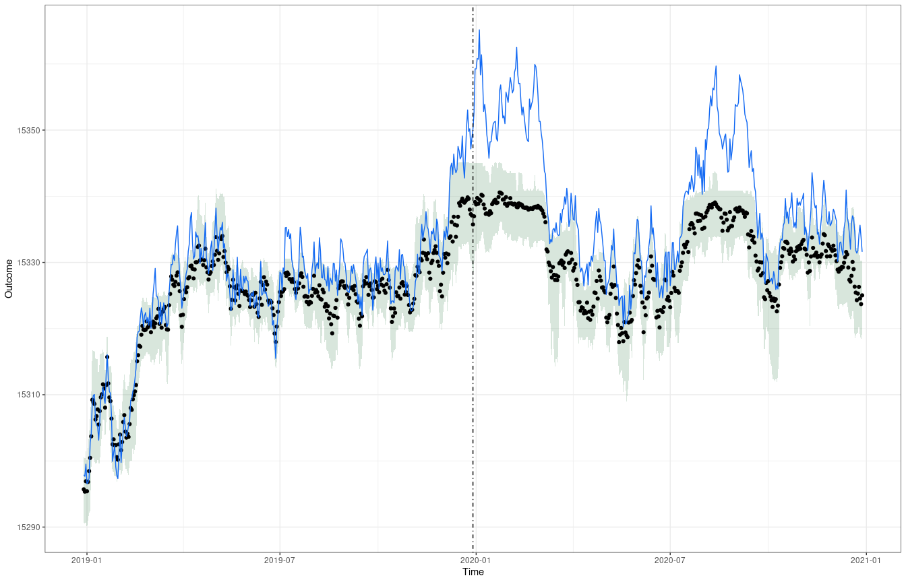

# syntCF  

<!--
### Version `r read.dcf("DESCRIPTION", "Version")`

[](https://github.com/bcgov/repomountie/blob/8b2ebdc9756819625a56f7a426c29f99b777ab1d/doc/state-badges.md)
[](https://opensource.org/licenses/GPL-3.0)
[](https://github.com/bcgov/bcmaps/actions)
[](https://cran.r-project.org/package=bcmaps) [](https://CRAN.R-project.org/package=bcmaps) 
<!-- badges: end -->


## Overview

`syntCF`is an [R](https://www.r-project.org) package that provides a set of tools to estimate the effect of a program or a policy using a robust time series synthetic counterfactual approach coupled with the double difference estimator within a Machine Learning framework. The package is inspired by the methods proposed in following contributions:

- [ ] [Grange, S. K., Carslaw, D. C., Lewis, A. C., Boleti, E., & Hueglin, C. (2018)](https://acp.copernicus.org/articles/18/6223/2018/)
- [ ] [Petetin, H., Bowdalo, D., Soret, A., Guevara, M., Jorba, O., Serradell, K., & Pérez García-Pando, C. (2020)](https://acp.copernicus.org/articles/20/11119/2020/#abstract)
- [ ] [Granella F., Reis L. A., Bosetti V. & Tavoni M. (2020)](https://iopscience.iop.org/article/10.1088/1748-9326/abd3d2)
- [ ] [Hammad, A. T., Falchetta, G., & Wirawan, I. B. M. (2021)](https://iopscience.iop.org/article/10.1088/2515-7620/abffa4)


The library uses a modified version of the robust random forest algorithm designed to take time dependency of the data into account trough block bootstrapping as developed in the library [rangerts](https://github.com/hyanworkspace/rangerts). To account to uncertainty in the predicted counterfactual time series, the library uses quantile regression forests [(Meinshausen, 2006)](https://www.jmlr.org/papers/volume7/meinshausen06a/meinshausen06a.pdf).

Classic ML metrics such as RMSE,MAPE and R2, are accompanied with additional metrics specifically designed to evaluate the goodness of the prediction intervals based on the work of [Gneiting, T., & Raftery, A. E. (2007)](https://viterbi-web.usc.edu/~shaddin/cs699fa17/docs/GR07.pdf).

The final effect estimation is based on a difference-in-difference (DID) to account for any systematic error in the trained model.

The library is built around `caret` and `ranger` to provide the user with a wide variety of options and speeding up training time. 

## Features
**Train, Test & Evaluate in one go**

Use `syntCFtrain()` and `syntCFmetrics()` to quickly train quantile Random forests with block bootstrapping and compute several evaluation metrics (RMSPE, MAPE,R2) including scoring rules metrics (interval score,sharpness, underprediction, overprediction).

**Estimation**

Estimate the effect of the treatment with `syntCFest()` using difference-in-difference (DID) to account for any systematic error in the trained model.

**Plotting**

`syntCFplot()` creates beautiful and easily customizable `ggplot2` plot to visualize to visually compare the factual and the counterfactual time series.




## Installation

You can install `syntCF` from CRAN:
```{r, echo=TRUE, eval=FALSE}
install.packages("syntCF")
```

To install the development version of the `syntCF` package, you need to install the `remotes` package then the `syntCF` package.

```{r, echo=TRUE, eval=FALSE}
install.packages("remotes")
remotes::install_github("athammad/syntCF")
```

## Vignettes

After installing the package you can view vignettes by typing `browseVignettes("syntCF")` in your R session. Or you can check this document where you will find an example with simulated data and method references.


## Getting Help or Reporting an Issue

To report bugs/issues/feature requests, please file an [issue](https://github.com/athammad/syntCF/issues/).


## Next Steps and TO DO list
- [ ] Include ensembles of caret models with `caretStack` from `caretEnsemble`
- [ ] Include the `pinball loss` metric used to assess the accuracy of a quantile prediction.

## References

- [Grange, S. K., Carslaw, D. C., Lewis, A. C., Boleti, E., & Hueglin, C. (2018). Random forest meteorological normalisation models for Swiss PM 10 trend analysis. Atmospheric Chemistry and Physics, 18(9), 6223-6239.](https://acp.copernicus.org/articles/18/6223/2018/)
- [Petetin, H., Bowdalo, D., Soret, A., Guevara, M., Jorba, O., Serradell, K., & Pérez García-Pando, C. (2020). Meteorology-normalized impact of the COVID-19 lockdown upon NO 2 pollution in Spain. Atmospheric Chemistry and Physics, 20(18), 11119-11141.](https://acp.copernicus.org/articles/20/11119/2020/#abstract)
- [Granella, F., Reis, L. A., Bosetti, V., & Tavoni, M. (2021). COVID-19 lockdown only partially alleviates health impacts of air pollution in Northern Italy. Environmental Research Letters, 16(3), 035012.](https://iopscience.iop.org/article/10.1088/1748-9326/abd3d2)
- [Hammad, A. T., Falchetta, G., & Wirawan, I. B. M. (2021). Back to the fields? Increased agricultural land greenness after a COVID-19 lockdown. Environmental Research Communications, 3(5), 051007.](https://iopscience.iop.org/article/10.1088/2515-7620/abffa4)
- [Wright, M. N. & Ziegler, A. (2017) ranger: A fast implementation of random forests for high dimensional data in C++ and R. J Stat Software 77:1-17.](https://doi.org/10.18637/jss.v077.i01)
- [Gneiting, T., & Raftery, A. E. (2007). Strictly proper scoring rules, prediction, and estimation. Journal of the American statistical Association, 102(477), 359-378.](https://viterbi-web.usc.edu/~shaddin/cs699fa17/docs/GR07.pdf)


