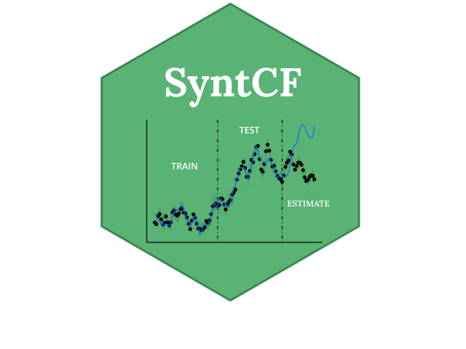

# syntCF  


### Version `r read.dcf("DESCRIPTION", "Version")`


<!-- badges: start -->
[](https://github.com/bcgov/repomountie/blob/8b2ebdc9756819625a56f7a426c29f99b777ab1d/doc/state-badges.md)
[](https://opensource.org/licenses/Apache-2.0)
[](https://github.com/bcgov/bcmaps/actions)
[](https://cran.r-project.org/package=bcmaps) [](https://CRAN.R-project.org/package=bcmaps) 
<!-- badges: end -->


## Overview

An [R](https://www.r-project.org) package of XXXXXXXXXX.

## Features
## Installation

You can install `syntCF` from CRAN:
```{r, echo=TRUE, eval=FALSE}
install.packages("syntCF")
```

To install the development version of the `syntCF` package, you need to install the `remotes` package then the `syntCF` package.

```{r, echo=TRUE, eval=FALSE}
install.packages("remotes")
remotes::install_github("athammad/syntCF")
```

## Usage

To see the layers that are available, run the `available_layers()` function:
```{r, echo=FALSE, warning=FALSE}
library(bcmaps)
```

```{r, eval=FALSE}
library(bcmaps)
available_layers()
```

Most layers are accessible by a shortcut function by the same name as the object. 
Then you can use the data as you would any `sf` or `Spatial` object. The first time
you run try to access a layer, you will be prompted for permission to download that layer
to your hard drive. Subsequently that layer is available locally for easy future access. For example:

```{r}
library(sf)
bc <- bc_bound()
plot(st_geometry(bc))
```

### Vignettes

After installing the package you can view vignettes by typing `browseVignettes("syntCF")` in your R session.

## Getting Help or Reporting an Issue

To report bugs/issues/feature requests, please file an [issue](https://github.com/athammad/syntCF/issues/).


## Licence

    # Copyright 2022 Province of British Columbia
    # 
    # Licensed under the Apache License, Version 2.0 (the "License");
    # you may not use this file except in compliance with the License.
    # You may obtain a copy of the License at
    # 
    # http://www.apache.org/licenses/LICENSE-2.0
    # 
    # Unless required by applicable law or agreed to in writing, software distributed under the License is distributed on an "AS IS" BASIS,
    # WITHOUT WARRANTIES OR CONDITIONS OF ANY KIND, either express or implied.
    # See the License for the specific language governing permissions and limitations under the License.
